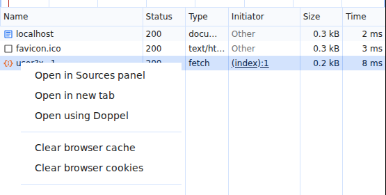
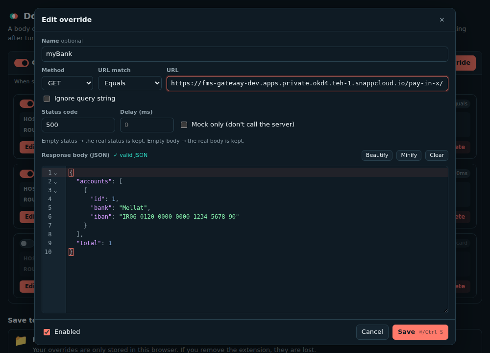
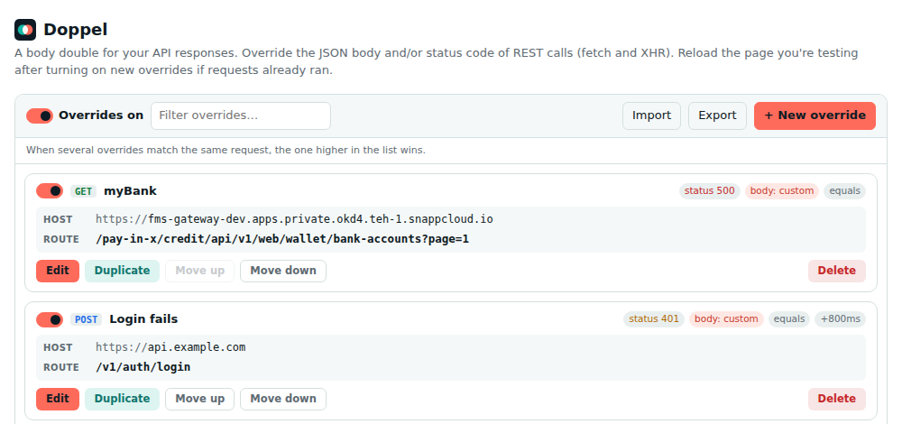

<p align="center">
  
</p>

<h1 align="center">Doppel</h1>

<p align="center"><b>A body double for your API responses.</b><br>
Override the status code and JSON body of any REST call, straight from Chrome's Network tab. Keep as many overrides on at once as you like.</p>

<p align="center">
  <a href="https://github.com/payandeh/doppel/actions/workflows/ci.yml"></a>
  <a href="https://github.com/payandeh/doppel/releases/latest"></a>
  <a href="LICENSE"></a>
  <a href="https://scorecard.dev/viewer/?uri=github.com/payandeh/doppel"></a>
  <a href="https://www.conventionalcommits.org"></a>
  
</p>

<p align="center">
  
</p>

---

## Why

Chrome's built-in **Override content** can't change the status code, and only one override can be active at a time.
Doppel lets you:

- **Change the status code, the body, or both.** Leave either one empty and the real value from the server is kept.
- **Run many overrides at once**, each with its own on/off switch, plus one switch to turn everything off.
- **Start from the real response.** Right-click a request in the Network tab → **Open using Doppel**, and the current response is copied into the editor.
- **Edit JSON properly** with syntax highlighting, folding, search, Beautify/Minify and a strict validator that points to the exact line and column of an error.
- **Save your mocks to a folder** (`doppel.json`), so they survive reinstalling the extension, work on other computers and can live in Git with your team.

## Install

Doppel isn't on the Chrome Web Store yet.

1. Download `doppel-<version>.zip` from the [latest release](https://github.com/payandeh/doppel/releases/latest) and unzip it (or clone this repo).
2. Open `chrome://extensions` and turn on **Developer mode**.
3. Click **Load unpacked** and select the unzipped folder (the one with `manifest.json`).
4. Close DevTools if it's open, then open it again (DevTools only loads extensions when it opens).

## Use

1. Open DevTools → **Network**.
2. Right-click a request → **Open using Doppel**.
3. Change the status and/or the JSON body, then **Save**.

<p align="center"></p>

Manage everything from the toolbar popup or the manager page (right-click the toolbar icon → **Options**):

<p align="center"></p>

### Override options

| Option        | What it does                                                                                     |
| ------------- | ------------------------------------------------------------------------------------------------ |
| Method        | `ANY`, or a specific HTTP method                                                                 |
| URL match     | **Equals** (optionally ignoring the query string), **Contains**, **Wildcard** (`*`) or **Regex** |
| Status code   | 200–599. Empty = keep the server's status                                                        |
| Response body | JSON. Empty = keep the server's body                                                             |
| Delay         | Wait before responding (ms)                                                                      |
| Mock only     | Don't call the server at all                                                                     |

When several overrides match the same request, the one higher in the list wins.

### Save to a folder

Manager page → **Save to a folder on your computer** → **Choose folder…**. Every change is written to `doppel.json` in that folder.

- **Reinstalled or on another computer?** Choose the same folder and your overrides load back.
- **Edited the file or pulled from Git?** Doppel picks up the change. If both the file and the browser changed, it asks whether to keep one version or merge them.
- Chrome asks for folder permission again after a browser restart. Click **Allow access** in the manager.
- A broken `doppel.json` is never overwritten. Doppel shows the error instead.

### Seeing overrides in the Network tab

Overridden requests show **`DOPPEL.js`** in the Network tab's **Initiator** column, and each one is logged in the Console as `[Doppel] …`.

## How it works

Doppel runs a small script in the page that wraps `fetch` and `XMLHttpRequest`. When a request matches an override, it
fetches the real response (unless **Mock only** is on) and hands the page the overridden status and/or body.

- Your overrides stay in the extension's isolated world. A page only ever receives the one override that matches a request
  it made, so other sites can't read your mock data.
- Faked XHRs support `timeout`, `abort()`, `responseType` (`json`, `text`, `blob`, `arraybuffer`) and response headers.

## Limitations

- Chrome's Network tab shows the **real** server response. The page receives the overridden one. Extensions can't set the
  purple "overridden" marker that Chrome's own Local Overrides use.
- Only REST calls made from the page (`fetch` / XHR) are covered, not requests from Web Workers or Service Workers.
- Status codes must be between 200 and 599, which is the browser's limit for fetch responses.
- The right-click item's label is set by Chrome ("Open using" + the extension's name).

## Development

No build step: edit the files and reload the extension in `chrome://extensions`.

```bash
npm install                        # dependencies and git hooks
npm test                           # static checks + unit tests
npx playwright install chromium    # once
npm run test:e2e                   # loads the extension in Chromium and tests real pages
```

Changes go through pull requests with [Conventional Commits](https://www.conventionalcommits.org/) and branch names like
`feat/har-import`. Git hooks and CI enforce both, and CodeRabbit reviews every pull request. See
[CONTRIBUTING.md](CONTRIBUTING.md).

```
manifest.json        extension manifest (MV3)
background.js        badge, editor window, folder auto-save
devtools.js          "Open using Doppel" handler + optional DevTools tab
content/inject.js    fetch/XHR interception (page world)
content/bridge.js    rule matching (isolated world)
content/DOPPEL.js    marks overridden requests in the Initiator column
lib/                 shared UI, matcher, JSON validator, folder sync
lib/vendor/          bundled CodeMirror 6 JSON editor (MIT)
tests/               unit (node:test) and end-to-end (Playwright) tests
tools/               checks, packaging, branch-name and source-map helpers
```

## Brand

|                                                                 |       |           |
| --------------------------------------------------------------- | ----- | --------- |
|  | Coral | `#FF6B5B` |
|  | Teal  | `#14B8A6` |
|  | Ink   | `#0F1B24` |
|  | Foam  | `#EEF9F7` |

The logo is two overlapping circles: the real response and its double, with the overlap where they look the same.

## Contributing

Issues and pull requests are welcome. Please read [CONTRIBUTING.md](CONTRIBUTING.md) and the [Code of Conduct](CODE_OF_CONDUCT.md). Report security problems privately, as described in [SECURITY.md](SECURITY.md).

## License

[MIT](LICENSE)
